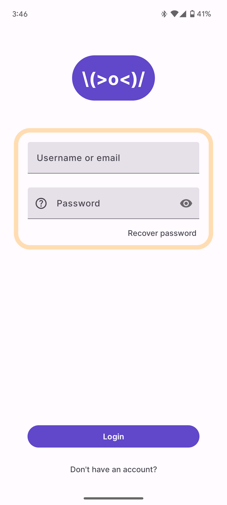
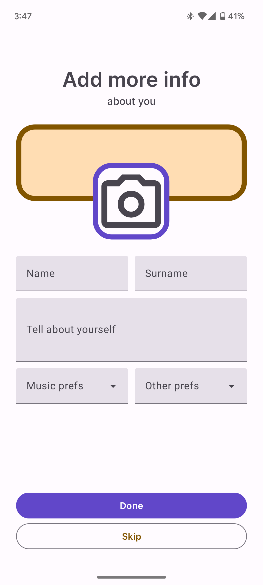
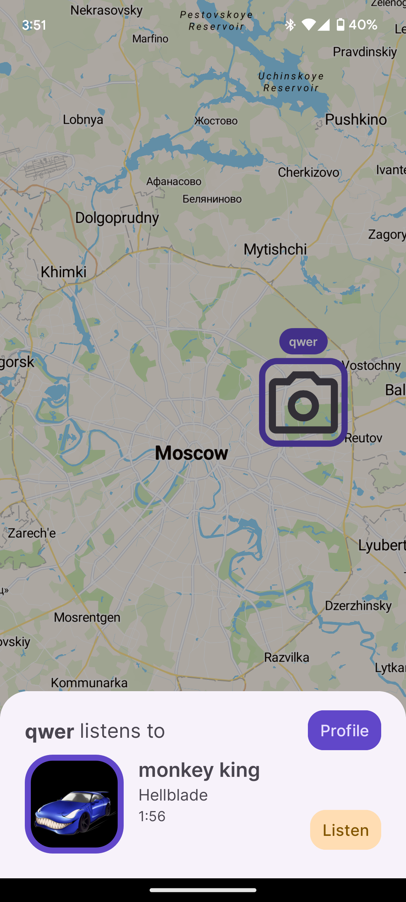
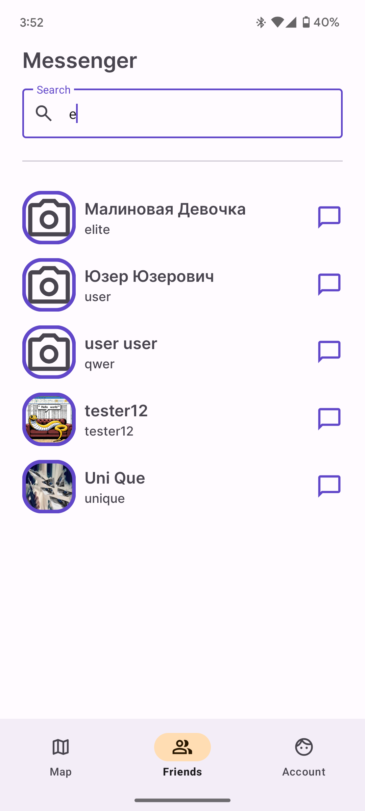

<div align="center">


### Client of the Rythmap project

<strong>[Русский](https://github.com/Rythmap/client-kt/blob/main/README_ru.md)</strong>

</div>

## 📱 `Screenshots`
<details>
  <summary>Expand</summary>
 
  <div align="center">
    
    
    
    
    
  </div>
</details>

## 😎 `Features`
* Ability to view people nearby and their currently playing music on a map
* Musical services linking
* Friends system

## ⚙️ `Technologies`
* MapLibre
* MVVM architecture
* Retrofit, OkHttp
* RecyclerView

## 🛠️ Build
1. Clone the repository
```bash
git clone https://github.com/Rythmap/client-kt/
```
2. Open the project in Android Studio
3. Build and run the project

## 🏢 Contributing
Contributions are welcome! Feel free to open an issue or submit a pull request if you have any ideas or bug fixes

## 📝 License
This project is licensed under GNU General Public License v3.0 - see the [LICENSE](LICENSE) file for details
